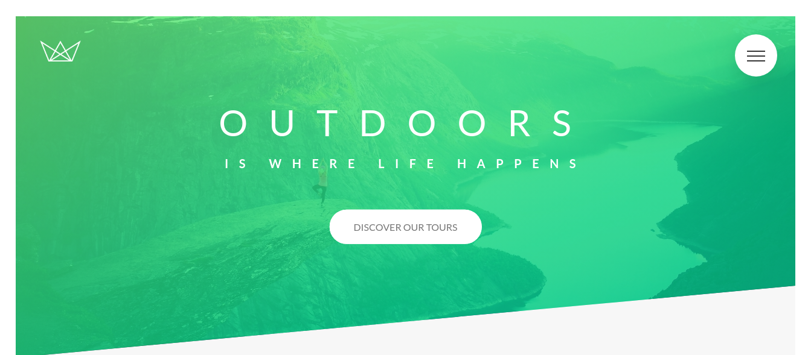

### CSS and Sass study files and projects

To see the projects:

1. Install dependencies
```javascript
yarn
```
or
```javascript
npm install
```

2. Check the `index.html` in your favorite browser

#### Previews
Natours:


Trillo:

